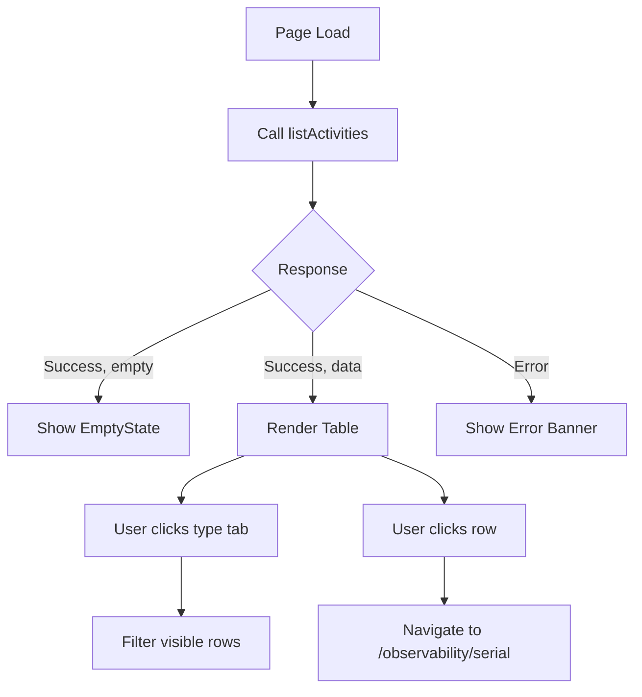
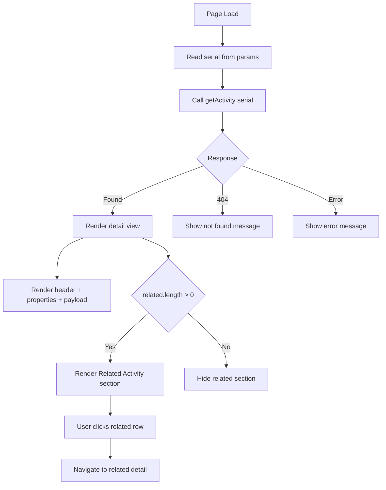
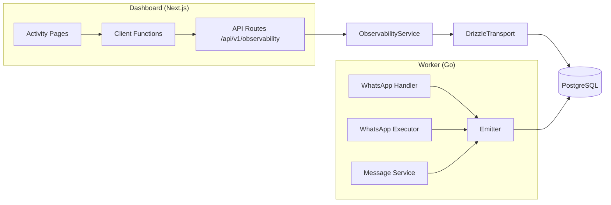

# PRD: Observability UI — Activity Log

## Context

Nexus (the developer dashboard) needs an Activity page where developers can
inspect every API request, inbound WhatsApp event, and webhook delivery. The
backend is fully implemented: two API endpoints, client functions, and all data
capture pipelines are live and tested. This PRD covers the UI layer only.

## Goals

- Provide a Stripe-like activity log in the Nexus dashboard.
- Allow filtering by event type (API request, WhatsApp event, webhook delivery).
- Allow drilling into individual events with payload inspection and related-event
  resolution.

## Non-goals

- Real-time WebSocket streaming or auto-refresh polling.
- Editing, deleting, or retrying activities.
- Resource detail pages (sessions, webhooks, API keys) — cross-links land on
  existing list pages.
- Retention, pruning, or export of activity data.
- Mobile-responsive layout beyond existing sidebar collapse.

## Features

### Activity List Page

#### Requirement

A developer SHALL view a chronological list of all activity events, filterable
by type, with each row navigating to a detail view.

#### Business Rules

- Events are ordered newest-first.
- Default view shows all types; type tabs filter client-side.
- Rows are non-interactive except for click-to-navigate.
- The page SHALL NOT require persisted API key auth (bootstrap-only endpoint).

#### Acceptance Criteria

- AC-001: WHEN the page loads, THEN a table renders with columns: Type, Summary, Phone, Status, Time.
- AC-002: WHEN no activities exist, THEN an empty state with icon, title, and description is shown.
- AC-003: WHEN data is loading and the list is empty, THEN a skeleton with 3 pulse rows is shown.
- AC-004: WHEN the user clicks a type tab, THEN only activities of that type are visible.
- AC-005: WHEN the user clicks a row, THEN the browser navigates to `/observability/[serial]`.
- AC-006: WHEN the API returns an error, THEN an error banner is shown above the table.

#### Technical Definition

- The list page SHALL be a `"use client"` Next.js page at
  `src/app/(app)/observability/page.tsx`.
- The page SHALL use a `useActivities` hook that calls the existing
  `listActivities()` client function.
- The hook SHALL follow the existing pattern: `useState` + `useEffect` +
  `useCallback` + `mountedRef`, with `data`, `loading`, `error`, `refresh`
  returns.
- Type filtering SHALL be client-side via `useMemo` on the fetched array.
- Table components SHALL use `Card`, `TableWrap`, `Table`, `TableHead`,
  `TableRow`, `TableCell`, `Mono`, `Badge` from `@/components`.
- Badge variants: `api_request` → `info`, `whatsapp_event` → `success`,
  `webhook_delivery` → `warning`; `ok` → `success`, `error` → `danger`,
  `attempted` → `warning`.

#### Flow



### Activity Detail Page

#### Requirement

A developer SHALL view a single activity event with its full payload and all
related events resolved through correlation columns.

#### Business Rules

- A "Back to Activity" link SHALL always be visible.
- The detail view SHALL show: type badge, status badge, timestamp, summary,
  and all non-null correlation fields.
- The payload SHALL be rendered as formatted JSON in a monospace block.
- Related activities SHALL be clickable and navigate to their own detail pages.

#### Acceptance Criteria

- AC-101: WHEN the page loads with a valid serial, THEN the activity header, properties, payload, and related section render.
- AC-102: WHEN `waMessageId` is non-null, THEN it is displayed in monospace.
- AC-103: WHEN `jobSerial` is non-null, THEN it is displayed with a link to `/jobs` or as monospace text.
- AC-104: WHEN `resourceType` and `resourceSerial` are non-null, THEN a link to the corresponding resource list page is shown (`/sessions`, `/webhooks`, or `/api-keys`).
- AC-105: WHEN `payload` exists, THEN a formatted JSON block is rendered in monospace.
- AC-106: WHEN `related` contains rows, THEN a "Related Activity" section lists each as a clickable mini-row with type badge, summary, status, and time.
- AC-107: WHEN the serial is not found, THEN a "not found" message with a back link is shown.
- AC-108: WHEN the page is loading, THEN skeleton blocks are shown for header, properties, and payload.

#### Technical Definition

- The detail page SHALL be at `src/app/(app)/observability/[serial]/page.tsx`.
- The page SHALL call `getActivity(serial)` from `@/lib/api/observability`.
- The payload block SHALL use the `Mono` component with
  `JSON.stringify(payload, null, 2)`.
- The back link SHALL use `next/link` to `/observability`.

#### Flow



### Navigation Item

#### Requirement

An "Activity" link SHALL appear in the sidebar under the Monitor group.

#### Acceptance Criteria

- AC-201: WHEN the sidebar renders, THEN "Activity" is the first item in the Monitor group.
- AC-202: WHEN the current path starts with `/observability`, THEN the Activity nav item is highlighted.
- AC-203: WHEN the user clicks Activity, THEN the browser navigates to `/observability`.

#### Technical Definition

- The Monitor group in `src/app/(app)/layout.tsx` SHALL include
  `{ icon: <IconActivity />, label: "Activity", href: "/observability" }` as
  the first item.
- Active state detection follows the existing `pathname.startsWith(item.href)`
  pattern.

### Icon

#### Requirement

A hand-ported SVG `IconActivity` SHALL be added to the icon set.

#### Acceptance Criteria

- AC-301: WHEN `IconActivity` is rendered, THEN a 24x24 stroke SVG with
  `viewBox="0 0 24 24"` is produced.
- AC-302: WHEN `IconActivity` receives `className` or `size` props, THEN they
  are applied.
- AC-303: WHEN the component is imported from `@/components/icons`, THEN it
  compiles without errors.

#### Technical Definition

- `IconActivity` SHALL follow the existing `IconProps` interface: `{
  className?: string; size?: number }`.
- Default size SHALL be 18.
- No lucide-react dependency. SVG SHALL be hand-ported inline.

## System Architecture



The UI connects to already-implemented API routes. The worker writes activity
rows asynchronously through a fire-and-forget emitter. The dashboard reads them
through the Drizzle transport.

## Data Model

```text
ActivityEvent (wire view-model)
- serial: string (UUID)
- type: "api_request" | "whatsapp_event" | "webhook_delivery"
- status: "ok" | "error" | "attempted"
- phoneNumberId: string | null
- businessAccountId: string
- summary: string
- jobSerial: string | null
- waMessageId: string | null
- sourceActivitySerial: string | null
- resourceType: "session" | "webhook_config" | "api_key" | "job" | null
- resourceSerial: string | null
- requestSerial: string | null
- payload: unknown (JSON)
- createdAt: string (ISO)

DetailResponse
- activity: ActivityEvent
- related: ActivityEvent[]
```

## Technical Constraints

- All UI components SHALL use the existing `@/components` barrel import.
- Icons SHALL be hand-ported SVG only; no new icon libraries.
- Hooks SHALL use plain `useState`/`useEffect`/`useCallback` with
  `mountedRef` — no data-fetching libraries.
- Pages SHALL be `"use client"` components following the existing
  `(app)` layout convention.
- The API is bootstrap-auth only; persisted keys MUST NOT authorize activity
  endpoints.
- No changes to the backend, migration, worker, or API routes are in scope.

## Definition of Done

- All acceptance criteria pass.
- `IconActivity` renders correctly in the sidebar and pages.
- The list page loads, filters, navigates, and handles empty/loading/error states.
- The detail page loads, renders all sections, handles not-found, and links to
  related activities.
- No non-goal behavior is introduced.
