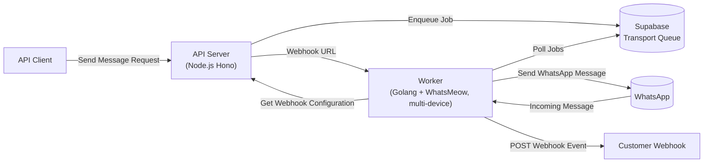
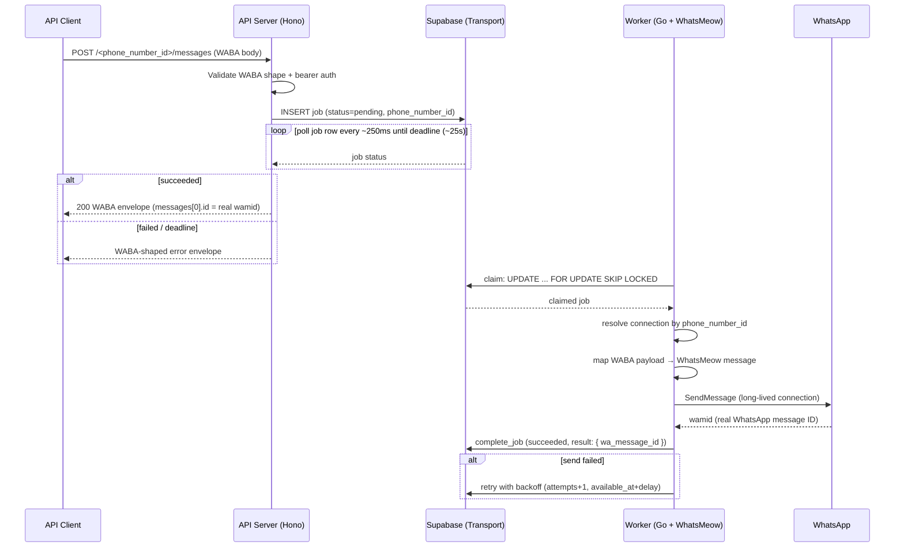
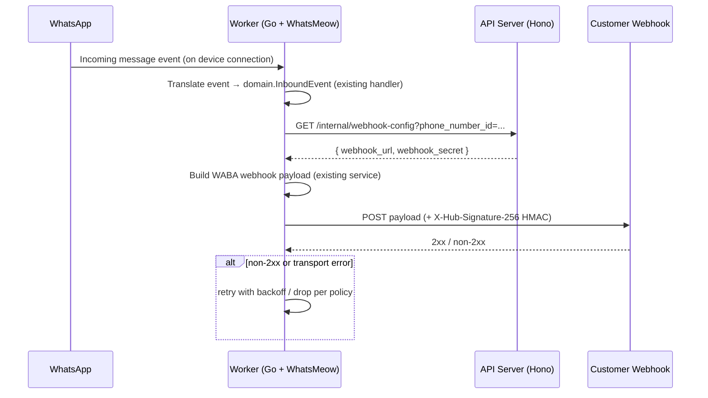

# Split Architecture: Hono API + Supabase Transport + Go Worker

## Objective

Split the current single Go service into three components:

- **API (Node.js, Hono, Vercel-compatible)** — public WABA-compatible surface.
  Validates send requests, enqueues jobs, waits for the worker result, and
  returns the official 200 WABA response shape. Serves webhook configuration.
- **Worker (Golang + WhatsMeow)** — one process, many WhatsApp connections
  (multi-device). Polls Supabase for jobs and executes them. Handles inbound
  events and forwards them to customer webhooks.
- **Transport (Supabase)** — durable job queue and webhook configuration.

## Repo Layout (Turborepo Monorepo)

```text
.
├── apps/                    # UI & frontend (placeholder for now)
│   └── .gitkeep
├── services/
│   ├── api/                 # Node.js Hono API (Vercel-compatible)
│   └── worker/              # Go + WhatsMeow worker (existing code moves here)
├── shared/
│   └── db/
│       └── migrations/      # SQL migrations (golang-migrate format)
├── package.json             # Turborepo root workspace
├── turbo.json
└── (existing Go files → services/worker/, own go.mod)
```

- Turborepo orchestrates `apps/*` and `services/api` (npm workspaces). The Go
  worker participates through `package.json` scripts (`build`, `test`, `dev`)
  that call `go build` / `go test`, declared as custom turbo tasks.
- All existing Go code (`cmd/`, `internal/`, `docs/`, tests, AGENTS.md,
  HANDOFF.md) moves to `services/worker/`.
- All database migrations live in `shared/db/migrations` in golang-migrate
  format and are executed with golang-migrate (see Transport section).
- `apps/` only gets `.gitkeep` for now; UI work is deferred.

## Decisions (confirmed)

| # | Decision |
| - | -------- |
| 1 | **Response: synchronous `200`** with the official WABA envelope including the real `wamid.…` message ID. |
| 2 | **Monorepo with Turborepo**; `apps/` (UI, gitkeep) + `services/` (api, worker). |
| 3 | **API framework: Hono** (compatible with Vercel deployment). |
| 4 | **Wake-up: polling**; Supabase Realtime only if needed later. |
| 5 | **Multi-device: 1 worker, N WhatsMeow connections**, routed by `phone_number_id`. |

## Flow Diagrams

### Overall



### Outbound (Send Message) — synchronous 200



### Inbound (Webhook Event)



## Components

### 1. Transport (Supabase)

#### Migrations (golang-migrate)

- Files live in `shared/db/migrations/`, shared by api and worker:
  `000001_create_jobs.up.sql` / `000001_create_jobs.down.sql`,
  `000002_create_webhook_configs.up.sql` / `000002_create_webhook_configs.down.sql`.
- Executed with golang-migrate. The worker runs `up` on startup (or via a
  dedicated `cmd/migrate`) using the `file://` source pointed at
  `MIGRATIONS_DIR` (default `shared/db/migrations`) against `SUPABASE_DSN`.
  CLI alternative: `migrate -path shared/db/migrations -database "$SUPABASE_DSN" up`.
- Applied versions are tracked in the `schema_migrations` table, so reruns are
  idempotent.

Table `public.jobs`:

```sql
create table if not exists public.jobs (
    id              uuid primary key default gen_random_uuid(),
    type            text not null default 'send_message',
    phone_number_id text not null,
    payload         jsonb not null,
    status          text not null default 'pending'
                    check (status in ('pending', 'claimed', 'succeeded', 'failed')),
    attempts        int  not null default 0,
    max_attempts    int  not null default 3,
    available_at    timestamptz not null default now(),
    claimed_by      text,
    claimed_at      timestamptz,
    completed_at    timestamptz,
    last_error      text,
    result          jsonb,
    idempotency_key text unique,
    created_at      timestamptz not null default now()
);

create index if not exists jobs_claim_idx
    on public.jobs (status, available_at, created_at);
```

Table `public.webhook_configs` (managed through the API; read by the worker via
the API, per the chosen flow):

```sql
create table if not exists public.webhook_configs (
    phone_number_id text primary key,
    webhook_url     text not null,
    webhook_secret  text,
    updated_at      timestamptz not null default now()
);
```

- **Write (API):** `supabase-js` REST `INSERT` with an idempotency key.
- **Claim (worker):** raw SQL via `pgx` (Supabase is Postgres; no RPC needed):

```sql
update public.jobs
   set status = 'claimed', claimed_by = $1, claimed_at = now()
 where id = (
     select id from public.jobs
      where status = 'pending' and available_at <= now()
      order by created_at
      limit 1
      for update skip locked
 )
returning *;
```

- **Complete:** `update public.jobs set status = $2, completed_at = now(),
  last_error = $3, result = $4 where id = $1;`
- Retry semantics: on failure set `status='pending'`, `attempts = attempts + 1`,
  `available_at = now() + 2^attempts seconds`; when `attempts >= max_attempts`
  mark `status='failed'` (dead-letter).

### 2. services/api (Node.js, Hono)

- Hono app, runnable on Node (`@hono/node-server`) and deployable to Vercel.
- `supabase-js` client for enqueue + result polling.
- Endpoints:
  - `POST /:phone_number_id/messages` — bearer auth (`API_AUTH_TOKEN`), WABA
    shape validation, optional idempotency key, `INSERT` job, then **poll the
    job row until deadline** and return the official 200 envelope with the real
    `wamid` from the worker result, or a WABA-shaped error envelope on failure
    or timeout.
  - `GET /messages/:id` — job status mapped to a WABA-shaped status (phase 2).
  - `GET /internal/webhook-config?phone_number_id=...` — worker-facing, protected
    by `INTERNAL_TOKEN`; returns `{ webhook_url, webhook_secret }`.
  - (later) CRUD for webhook configs.
- Config: `PORT`, `SUPABASE_URL`, `SUPABASE_SERVICE_KEY`, `API_AUTH_TOKEN`,
  `INTERNAL_TOKEN`, `SEND_TIMEOUT_MS` (default 25000), `RESULT_POLL_MS`
  (default 250).

> Caveat: Vercel serverless functions have execution-time limits (Hobby ~10s,
> higher on Pro). A synchronous wait of ~25s may not fit on Vercel; if that
> becomes a constraint, add async mode (`202` + status endpoint) behind a
> config flag.

### 3. services/worker (Go)

Reuses most of the existing Go code — it moves to `services/worker/`, with the
Echo HTTP adapter removed.

- **Removed:** `internal/adapters/httpapi/` (Echo), its `cmd/main.go` wiring,
  HTTP-side config (`PORT`, `API_AUTH_TOKEN`).
- **Kept:** `adapters/whatsmeow` (event translation + dispatch), `service/`
  (WABA payload mapping, outbound validation), `adapters/webhook` (forwarding +
  HMAC), `domain`, `ports`, tests.
- **New — multi-device connection manager:** `ClientRegistry` keyed by
  `phone_number_id`. Each device owns a WhatsMeow client with its own bounded
  outbound channel and worker goroutine. Devices come from config
  (e.g., `WABA_DEVICES=62812...,62813...`); QR login and reconnect handled per
  device. Inbound events keep the existing anti-corruption handler, now wired
  per device.
- **New — queue consumer:** `internal/adapters/queue` (pgx) — poll loop
  (`POLL_INTERVAL`, default 1s), claim with `SKIP LOCKED`, complete/retry.
- **New — outbound executor (service layer):** on claimed job → resolve the
  connection by `phone_number_id` → validate → `ports.MessageSender` → store
  the real WhatsApp message ID in `result`.
- **New — webhook config provider:** `ports.WebhookConfigProvider` +
  `internal/adapters/apiconfig` — before forwarding an inbound event, call
  `GET {API_URL}/internal/webhook-config` with `INTERNAL_TOKEN`; cache per
  `phone_number_id` with a short TTL.
- **Inbound flow:** WhatsMeow event → existing translation → fetch config from
  API → build WABA payload → forward via existing webhook adapter (HMAC with
  returned secret); retry policy on non-2xx.
- **Shutdown:** stop poll loop → drain per-device queues → disconnect all
  WhatsMeow clients.
- Config: `SUPABASE_DSN`, `MIGRATIONS_DIR`, `POLL_INTERVAL`, `API_URL`,
  `INTERNAL_TOKEN`, `MAX_ATTEMPTS`, `WABA_DEVICES` + existing WhatsMeow/WABA
  env vars.

## Milestones

1. **M1 — Monorepo restructure:** Turborepo root (`package.json`, `turbo.json`),
   `apps/.gitkeep`, move Go code to `services/worker/`, scaffold
   `services/api` (Hono hello-world + turbo tasks). Go tests still green.
2. **M2 — Supabase schema + migrations:** write `shared/db/migrations`
   (golang-migrate format) for `jobs` + `webhook_configs`; wire golang-migrate
   execution into the worker; local Supabase for dev/testing.
3. **M3 — services/api:** enqueue + synchronous result wait + auth + internal
   webhook-config API; API tests (Hono + Vitest).
4. **M4 — services/worker:** `ClientRegistry` (multi-device) + queue consumer +
   outbound executor + inbound config provider/forwarding; Go tests.
5. **M5 — Integration + cleanup:** remove Echo adapter remnants, end-to-end
   local run (API + worker + Supabase), update `README.md`, `HANDOFF.md`, and
   this plan; `gofmt`/`go test ./...`/`go vet ./...` + API test run.

## Acceptance Criteria

- `POST /:phone_number_id/messages` returns **200** with the official WABA
  envelope containing the real `wamid.…` from WhatsMeow, after the worker sends.
- One worker process manages N WhatsApp connections; jobs route to the correct
  device by `phone_number_id`.
- Incoming WhatsApp message → worker fetches webhook config from the API →
  WABA payload forwarded to the customer webhook with correct HMAC.
- No WhatsMeow connection is created per job.
- Failed jobs retry with backoff and end in `failed` after max attempts.
- Graceful shutdown without losing in-flight work.
- Go checks (`gofmt`, `go test ./...`, `go vet ./...`) and API tests pass.

## Open Items

- Vercel deployment target — if the API runs on Vercel serverless, sync-wait
  may hit function duration limits (async mode as fallback).
- Webhook config management surface (CRUD API/UI in `apps/` later).
- Device provisioning flow (registering phone numbers, QR login lifecycle,
  reconnection policy).
