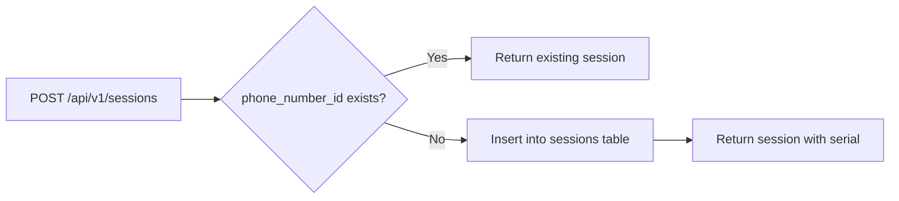
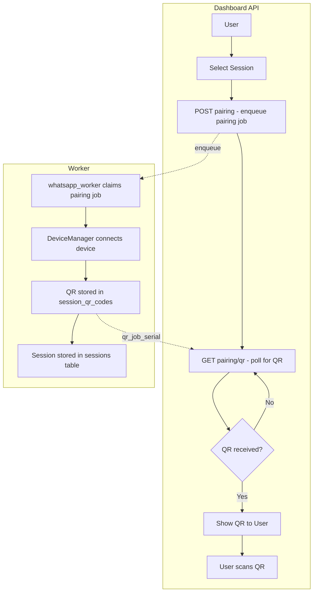
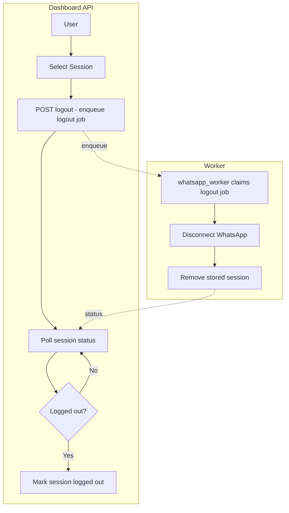
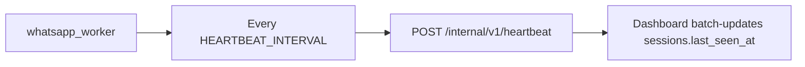
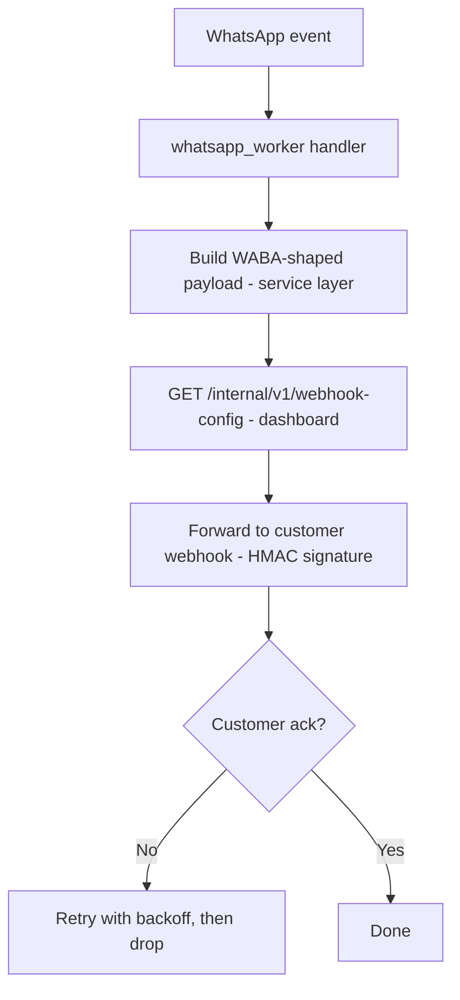
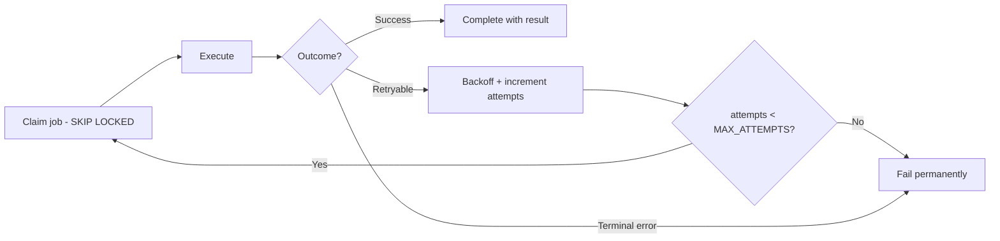

# Runtime Flows

Mermaid diagrams for the current runtime flows. Architecture reference:
[docs/architecture/README.md](architecture/README.md).

## 1. Session Creation



Session create is idempotent per `phone_number_id`.

## 2. Pairing Session



The QR payload is persisted in `session_qr_codes`; the dashboard polls
`GET /api/v1/sessions/<serial>/pairing/qr` until it appears, then shows it.

## 3. Logout Session



## 4. Heartbeat



## 5. Send Message

```mermaid
flowchart TB

subgraph Dashboard API
    A[Request send message]
    B[Insert jobs row]
    C[Poll jobs for terminal status]

    A --> B --> C
end

subgraph cmd/worker dispatcher
    D1[Claims jobs row - SKIP LOCKED]
    D2[Validates payload]
    D3[Inserts whatsmeow_jobs row - source_job_serial]
    D4[Returns ErrDispatched - jobs stays claimed]

    D1 --> D2 --> D3 --> D4
end

subgraph cmd/whatsapp_worker executor
    E1[Claims whatsmeow_jobs row]
    E2[ensureDevice - lazy connect]
    E3[SendMessage - real wamid]
    E4[Writes terminal status + result to jobs]

    E1 --> E2 --> E3 --> E4
end

B -. insert .-> D1
D3 -. whatsmeow_jobs .-> E1
E4 -. result.wa_message_id .-> C
C --> F[Return WABA 200 envelope with wamid]
```

> The engine path above is wired end-to-end (queue → dispatcher → executor →
> write-back), but the **public send route is not exposed yet** — it was in the
> archived Hono API and is pending in the dashboard (ROADMAP Phase 3).

## 6. Incoming (WhatsApp -> Customer Webhook)



## 7. Generic Job Retry


