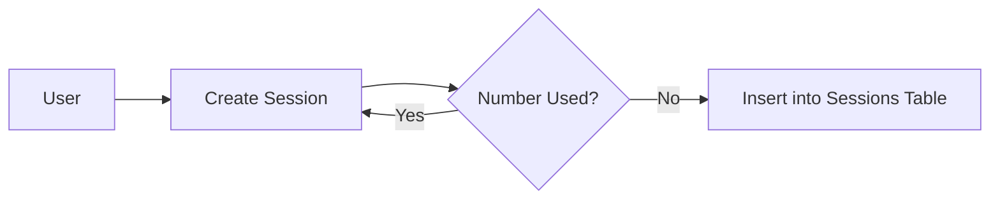
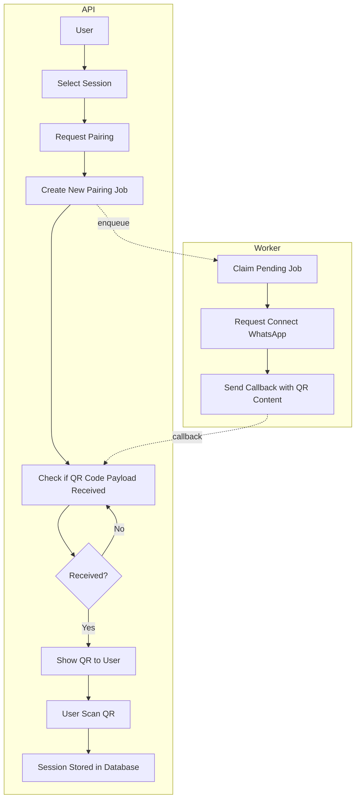
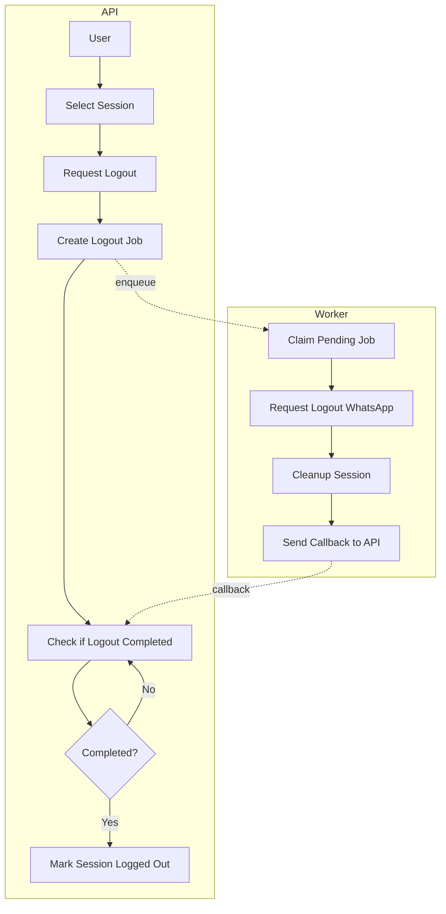
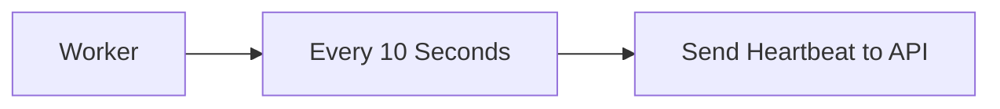
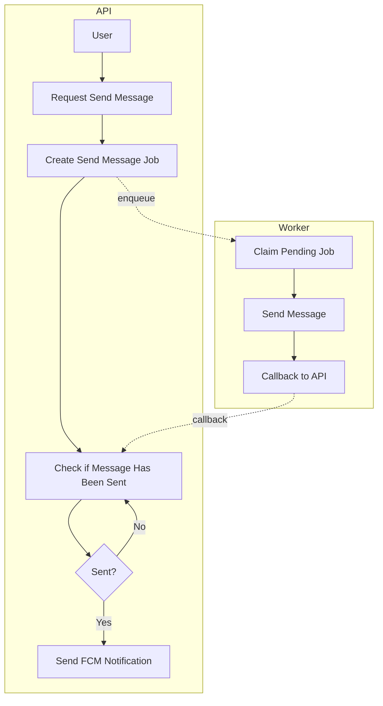
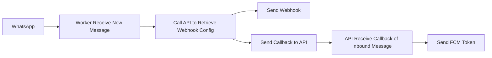
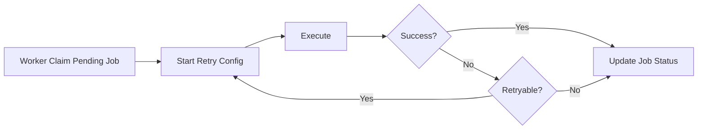

## 1. Session Creation

---

## 2. Pairing Session

---

## 3. Logout Session

---

## 4. Heartbeat

---

## 5. Send Message

---

## 6. Incoming WhatsApp Message

---

## 7. Generic Job Retry

